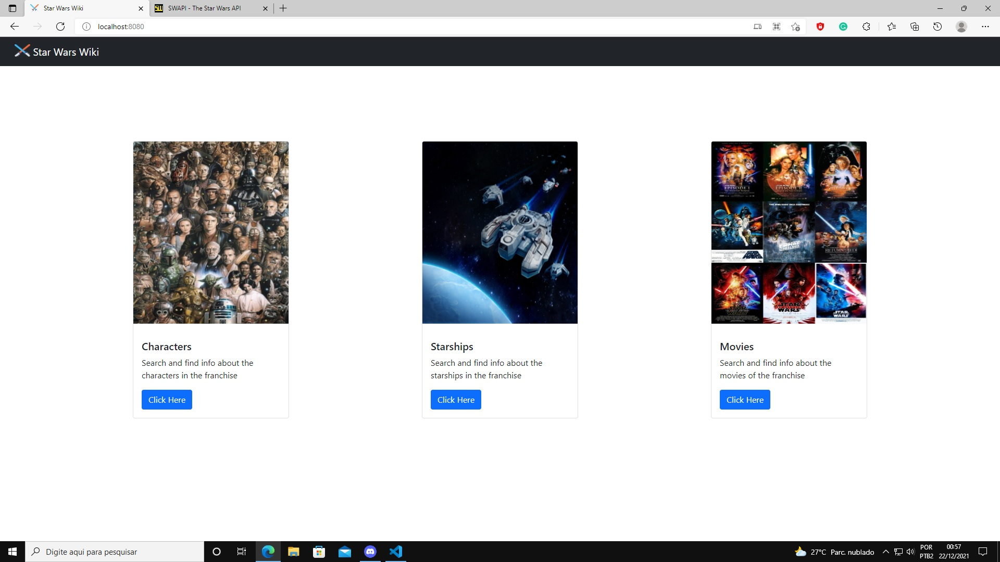
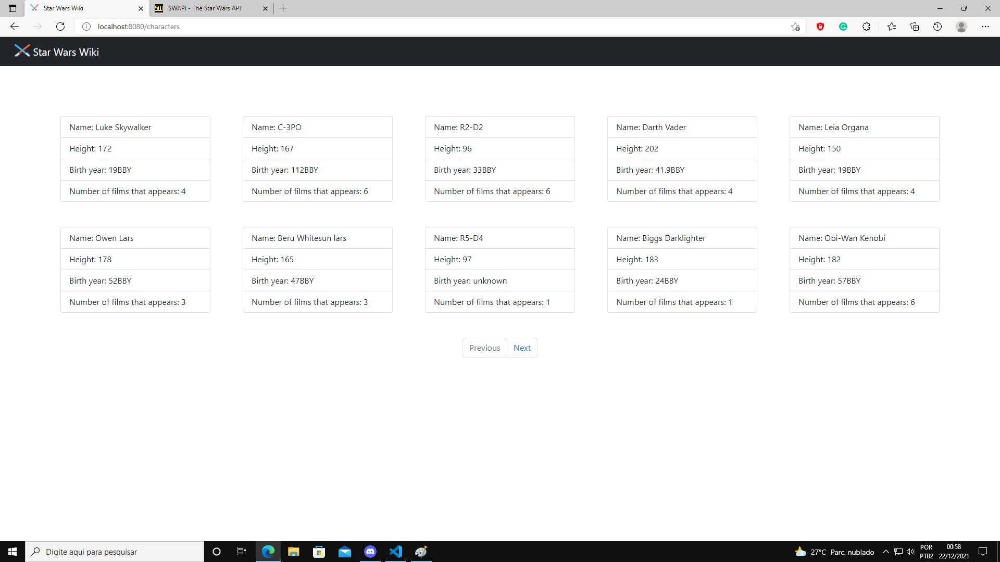
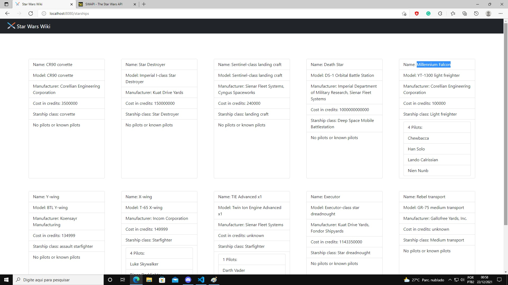
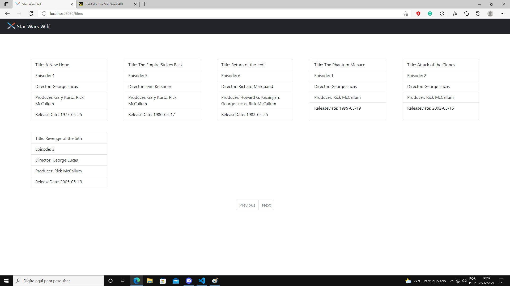

# How to execute
Open in your favorite java IDE and execute the project (I've used Maven for dependecy management), the project default port is 8080.

# What it does

The backend make requests to the API according to the url on the browser and build a web page to display the data.

obs: It's responsive for smartphones too.

## Dependencies used

- Spring boot
- Lombok
- Freemarker
- Bootstrap

## Screenshots

# 🚀 Backend challenge

Welcome. This is our Star Wars Backend Challenge!

Our main goal is to evaluate your coding and presentation skills.
When you feel ready to submit your answers, use the link we sent to your e-mail to post your Github Repo!
We will send you further instructions and your feedback then.

<!-- Quando sua solução estiver pronta, basta responder o e-mail que recebeu com o link do seu repo aqui no Github!
Em seguida, enviaremos o feedback e as instruções dos próximos passos! -->
Any questions, don't hesitate to contact us on *contato.steamgroups@gmail.com*
Happy Hacking💙!
<!-- Caso tenha alguma dúvida, nós estamos disponíveis no email *contato.steamgroups@gmail.com*
Bom desafio! -->

> ⚠️ **Remember, your repository must be public, otherwise we won't be able to evaluate your answer**

---

## Table of Contents

- [🧠 Context](#-context)
  - [⚔️ The Challenge](#️-the-challenge)
  - [🏁 Requirements](#-requirements)
  - [🤟 You Must](#-you-must)
  - [🚰 Ideal Flux](#-ideal-flux)
- [✔️ Evaluation Criteria](#️-evaluation-criteria)
- [:notebook: To-do list](#notebook-to-do-list)
- [You can](#-you-can)

# 🧠 Context

To test your intergalactical coding habilities, we brought from a far, far galaxy a unique challenge for coders capable to work with APIs.
We need to obtain some information about the StarWars movies in order to *present* to some of our partners how great the SW Cinematographic Universe is.

- Use the [SWAPI](https://swapi.dev/) API to get the data you need.

## ⚔️ The Challenge

The challenge is far, far simple: you must get the data asked at [You Must](#-you-must) using the SWAPI API and exhibit the results visually the best way you can. You can create a presentation, graphics, Charts or what you feel is the best. 

### 🏁 Requirements

- API Knowlegment
- JAVA Knowlegment

#### 🤟 You Must:

- [x] Code in Java
- [x] You must find the characters who appear the most in the SW movies (you can put them in order if you want);
- [x] Verify how many pilots did the Millenium Falcon had and who were they?;
- [x] Present the results the best way you can

<!-- - [ ] Obtain the Planets Size (Area) and order them (bigger to smaller); -->

### 🚰 Ideal Flux

- Find characters and movies via the API;
- Find the ship;
  - How many pilots drove it;
  - Their respective names;
- Visually represent the data obtained

<!-- - Get the planets and the Area of each one;
  - :warning: Find the diameter and calculate the area; -->

---

**Essential Operations**

- [x] Read the documentation;
- [x] Save the characters and pilots in variables;
- [x] Save what you find necessary in variables;
- [x] :warning: display the code output data;
 
 <!-- - [ ] Save the characters, planets and pilots in variables; -->

## ✔️ Evaluation Criteria

In addition to the requirements raised above, we will look at the following criteria when correcting the challenge:

- If the challenge was fully accomplished;
- Whether the steps were successfully completed;
- If the code is clean and well documented;
- If the code is optimized;
- The form of presentation;
- Concern for the end user;

### :notebook: To-do list

- [x] Fully take the challenge
  - [x] find the characters who appear the most in the SW movies;
  - [x] Check how many people have piloted our dear Millennium Falcon and display their names;
- [x] Include details of your solution in the README
  - [x] what was accomplished in the challenge;
  - [x] instructions on how to check what was fulfilled;
  - [x] print the images that prove your solutions;
  - [x] README must be in English;

<!--   - [ ] Get the Area of the planets and sort from Largest to Smallest; -->

### You can:
:information_source: _Feel free to include all the observations you may find necessary_

---

Made with 💙 by SteamGroups
